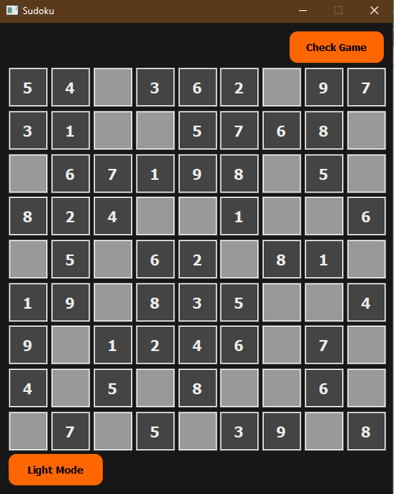
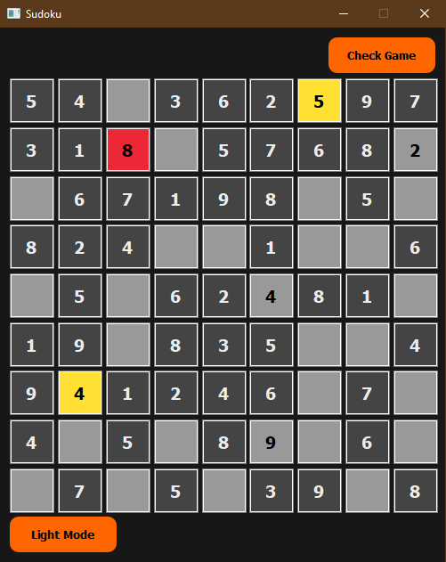
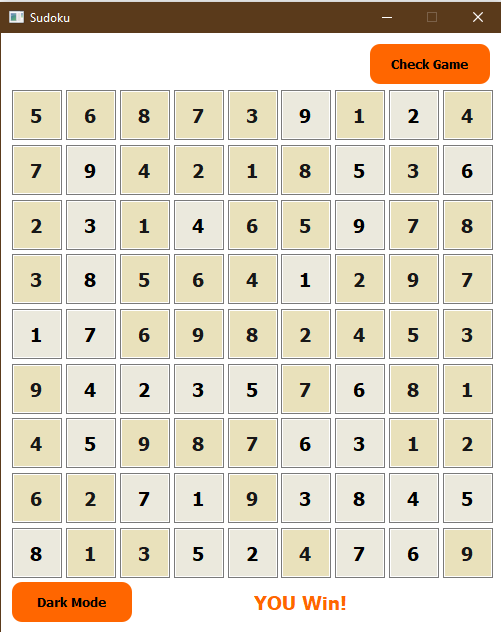

# Sudoku

Sudoku game written in Python language

<b>Game Logic
<b/>

the same single integer may not appear twice in the same row, column, or any of the nine 3×3 subregions of the 9×9 playing board.

The duplicate number in the 3x3 squares is marked in yellow and the duplicate number in the row or column with length 9 is marked in red.

  

